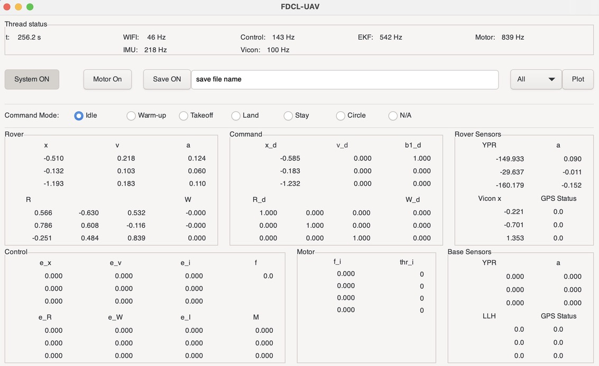
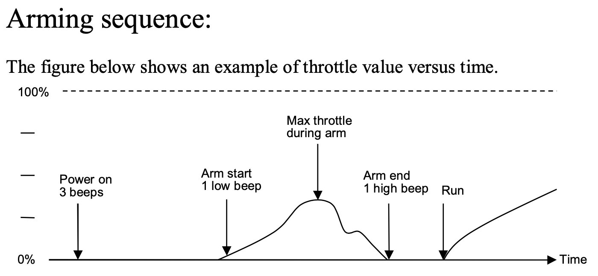

# UAV Build Guide
Written by GW RTX Drone Challenge Team

## Components Needed:

### Quadcopter:
- Motors (x4): T-Motor MN3110-17 KV-700
- Frame:
- ESC (x4): 
- Jetson Orin Nano
  - NVME SSD (recommended: Crucial P3 500GB)
- 4s 3-5000mAh LiPo Battery
- VN100 IMU
- 5V regulator
- Adafruit PCA9685 PWM Converter Board
- 5-6 Refelctive Markers
- Wires and mounting hardware


# Frame Assembly

## Step 1: Assemble the frame. 
This will include screwing arms to the main plate of the frame. Some frames will have power distribution pads on the frame base plate (labeled with "+" and "-"). If this is the case, create and attach a battery lead with XT60 connector to to the baseplate. To do this, solder a black and a red wire (between 12-16 AWG, but use same gauge for both wires) to a male XT60 connector (the one with the two, golden prongs). Then connect the other end of the red wire to the large "+" pad on the plate of the frame, and the black wire to the large "-". See Soldering 101 in Appendix for details about soldering.

IMG

You may also want to attach a large capacitor to the pads where you soldered the battery lead. Since our UAV will draw bursts of current, the capacitor will help keep the voltage stable.

## Step 2: Attach Motors and ESCs
For each of the arms on the frame, screw on the motor _using the 4 provided motor screws that came with the motor_. If the motor has mutliple screw holes in its base, use the 4 which are symetrically located around the shaft.

For each arm/motor, place an ESC on the upper side of the arm. Make sure to leave some open space on the arm so that we can later attach VICON reflective markers on the arms. You can attach the ESC using zipties, and it should be oriented on the arm such that the +/-/signal wires should face the center of the frame, and the three pads/wires on the opposite side of the ESC face the motor.

For the wiring of the ESC, connect the __three wires__ from the motor to the __three pads__ sometimes labeled A,B,C. The order doesn't matter for right now, as we will swap them later when testing motor spin direction. Then, on the other side of the ESC, connect a red wire (18 AWG) to the "+" and a black wire to the "-" pads on the other side of the ESC. Then, finding an available "+" and "-" pair on the frame base plate, connect the respective wires to those pads. 
- Note: since voltage is constant in a parallel circuit, each of the "+" and "-" pads on the frame base plate will share the same voltage coming from the LiPo battery.

Lastly, the thin black and white braided wire should already be attached to the ESC. The __white__ wire is the PWM Signal wire, while the __black__ wire is Ground (GND). 


## Step 3: Attach IMU
When attaching the IMU, placement is very important. Before doing anything, put a small rubber mat underneath the IMU in order to dampen the effects of the vibrations coming from the motors.

On the IMU are three axes - x,y,z - and they correspond to the directions of the IMU's coordinate system. When mounting, place the IMU __UPSIDE DOWN__ at the center of mass of the frame. Then, rotate the IMU such that the x-axis of the IMU is aligned with one of the arms of the frame (in the code, this arm will then be refered to as body axis 1 (b1, or arm1)). If done correctly, when looking at the underside of the frame, you should see the red part of the IMU with the x- axis arrow pointing along arm 1 of the frame. MAKE SURE THE IMU IS AS LEVEL AS POSSIBLE.

IMG

### Additional Information:
If the IMU is not connected to the black connector, do the following:

First we need to prepare a 4 wire ribbon cable. The cable should be stripeed and split up near the end, and we need to solder on male bullet connectors. This can be done by placing a bundle of solid solder into the connector, similar to how we did it with the power supply connector. Apply heat with the iron using the small hole found on the side of the connector and push the wire further in until it is secured.

NATHAN IMG

Next it needs to be connected to the IMU using a connector. We use a ten pin connector, but the ribbon cable is only connected to it at 4 points. The image belowe shows the exact pins that should be inserted into the connector. Hot glue can be applied to the open side of the connector to keep the cables in place.

NATHAN IMG

## Step 4: PWM Converter Board:
The Jetson sends motor signals using I2C, but the ESCs we use only take in PWM signals. Thus, we need to use a converter board which converts the signal. 

When looking at the PCA9685 boardfrom the front (with the blocks of 4x4 pins on the bottom), we will be using the first 4x4 pin header block (columns labeled 0-4) to connect our ESCs. For the ESC on arm 1 of the frame (see Step 3), connect it's white wire to the PWM pin of column 0, and it's black wire to the GND pin of column 0. This should be straightforward, as many ESCs come with a plastic connector that can be plugged directly into the pins. Then, continuing clockwise from arm 1(when looking at the frame from above), connect ESC2 to the column 1 pins. Do this for the remaining ESCs.

At this point, the ESCs are connected to the converter board, but we have not yet connected the board to the Jetson. We will leave this for a later step, but for now, just make sure to keep the pins on the left side of the board accessible. Specifically, __GND, SCL,SDA, and VCC__. 

IMPORTANT: When attaching the converter board to the frame, make sure to insulate it's underside from any other electrical contact. It is very easy to short the board since all pins are exposed on both sides of the board.


### Additional Information: 
Depending on whether the board can be successfully addressed from the code, you may need to change the converter board's address. To do this, add a solder bridge on pads A0 and A1 pads in upper right corner of board. This will change the default board address from 0x40 to 0x43.

5V Regulator

## Step 5: 5V Regulator
Sometimes the Jetson's 5V output pins will not output exactly 5V, which can cause issues since we power our IMU and PWM Converter board with 5V. To solve this, we use a 5V regulator. On the regulator, connect the pad labeled "IN 6-35V" to "+" battery voltage, and "GND" to a "-" battery voltage. Then, connect the "OUT 5/12V" to the component needed a 5V power source, and the "-" pad to an available GND pad.

IMG

If multiple components need a 5V, consider using a small breadboard that you can plug things in to.

## Step 6: Mounting Jetson and connecting wires.
Using a 3D printed mount, attach the jetson to the top of the frame. Make sure not to pierce the underside of the Jetson with any screws that may be protruding from the top of the frame. The only constraint when mounting the jetson is that you can reach the pin row with all the wires that need to be plugged into it. Also, you will need to create a male XT60-to-barrel adapter so that the Jetson can be powered from the battery. You can use the same barrel that the Jetson Orin Nano comes with.

IMU Connections:
From | To
---|---
IMU 5V | 5V regulator "+" 
IMU GND| 5V regulator "-"
IMU RX| Jetson Pin 8
IMU TX| Jetson Pin 10

- If using the IMU with BAUD=230400, f=200Hz, orange wire is IMU RX, yellow wire is IMU TX.

PCA9685 Connections:
From | To
---|---
PCA9685 VCC | 5V regulator "+" 
PCA9685 GND | 5V regulator "-"
PCA9685 SDA | Jetson Pin 3
PCA9685 SCL | Jetson Pin 5

Refer to the following datasheets for additional details:
- VN100: p.26/101 https://mpt-internal.uni-hohenheim.de/lib/exe/fetch.php?media=sensors:vn-100_user_manual.pdf
- Jetson Orin Nano: https://jetsonhacks.com/nvidia-jetson-orin-nano-gpio-header-pinout/
- PWM Converter Board (PCA9685): https://learn.adafruit.com/16-channel-pwm-servo-driver/pinouts

### Final Comments
After everything is connected, make sure keep the area around the arms where the propellers will free. This may mean reorganizing wires, and taping things down.


# Jetson Orin Nano Configuration
## Step 1: Setup Jetson
See [jetson-setup.md](jetson-setup.md) in RTX-Documents.

After the jetson is configured, record it's IP Address. This can be found my connecting a monitor to the Jetson, and going to WIFI settings. Then select the small "Settings" wheel next to the connected WIFI network. The IP Address of the Jetson is the number under "Detault Route", or "DNS".


## Step 2: Setup Flight Code
You will need two computers for this part: the Jetson Orin Nano (ROVER), and either a Linux or Mac computer (BASE). On the BASE computer, open two terminals:

### Terminal 1 (ROVER)
1. type ```$ ssh fdcl@192.168.10.34``` into a terminal, replacing the ```192.168.10.34``` with your Jetson's IP address and ```fdcl``` with the account username associated with your Jetson. Enter your Jetson's password.
2. Clone and build the flight code:
    1. Clone the fdcl-uav_rtx repo: ```$ git clone https://github.com/fdcl-gwu/fdcl-uav_rtx.git```. You'll need to be logged into github for this.
    2. Change into directory: ```$ cd fdcl-uav_rtx```
    3. Switch to quad_x_race branch: ```$ git checkout quad_x_race```
    4. The VRPN library is empty when you clone the flight code. To fix this, go into fdcl-uav_rtx/libraries and run ```$ git clone git@github.com:fdcl-gwu/vrpn.git```
        - If /libraries/vrpn/submodules/hidapi is empty, enter the /libraries/vrpn/submodules directory and run ```$ git clone https://github.com/signal11/hidapi.git```
    5. Go back to fdcl-uav_rtx/ directory and run ```$ . setup_uav.sh```
    6. When prompted, uncomment pc_linux in the 4 files
    7. From /build directory, run ```$ cmake ../ ```
    8. Finally, run ```$ make rover```

### Terinal 2 (Base)
2. Clone and Build Flight Code:
    1. Clone the fdcl-uav_rtx repo: ```$ git clone https://github.com/fdcl-gwu/fdcl-uav_rtx.git```. You'll need to be logged into github for this.
    2. Change into directory: ```$ cd fdcl-uav_rtx```
    3. Switch to quad_x_race branch: ```$ git checkout quad_x_race```
    4. The VRPN library is empty when you clone the flight code. To fix this, go into fdcl-uav_rtx/libraries and run ```$ git clone git@github.com:fdcl-gwu/vrpn.git```
        - If /libraries/vrpn/submodules/hidapi is empty, enter the /libraries/vrpn/submodules directory and run ```$ git clone https://github.com/signal11/hidapi.git```
    5. Go back to fdcl-uav_rtx/ directory and run ```$ sh setup_uav.sh```
          - On Linux, replace ```sh``` with ```.```
    6. When prompted, uncomment pc_linux in the 4 files
    7. From /build directory, run ```$ cmake ../ ```
    8. Finally, run ```$ make base```

Documentation reference: https://fdcl-gwu.github.io/fdcl-uav/

## Step 3: Configure Flight Code
Make the following code changes:

### Terminal 1 (ROVER)
For explanation of Steps 1,2 below, see [X Configuration](#X-Configuration).
1. src/fdcl_control.cpp
    - in ```fdcl::control::load_config(void)```, change ```fM_to_forces``` depending on where the motors are with respect to the body 1 axis.
2. src/fdc_ekf.cpp
    - in ```fdcl::ekf::init(void)```, change ```R_bi``` and ```R_mb``` depending on whether using X or + shape.
3. rover.cfg
    - IMU:port: ttyTHS0 or ttyTHS2
    - IMU:baud_rate: either 230400 or 115200
    - WIFI:server_ip_addr: IP Address of Jetson
    - I2C:port: NOT USED
    - VICON:rover_quad: "NAME_OF_VICON_OBEJCT@192.168.10.1"
      - _Unless you already made a vicon object, set VICON:on to 0 for now. We'll update this in a later step._
    - UAV:m_quad: mass of quadcopter
    - MOTOR:calib: coefficients from Motor calibration section 
4. include/common_types.hpp
    - Uncomment applicable DEFINE statements within first 100 lines of the file. We are using PWM escs, so uncomment ```#define PWM_ESC```
5. include/JHPWMPCA9685.h: 
    - ```PCA9685(int address=0x43)```: replace 0x43 with board address (default=0x40).
6. src/JHPWMPCA9685.c: 
    - kI2CBus = #: The I2C bus being used on the Jetson (/dev/i2c-#_
        - Pins 3,5 use I2C Bus 7 (to check, run ```$ sudo i2cdetect -y -r 7```)
    - in ```int thr_val = map(thr[motor_index],0,250,204,409);```, change the numbers `204` and `409` to be `234` and `441` respectively.
    - in ```fdcl::i2c::open(void)```, change the `204` in ```pca9685->setPWM(i,0, 204)``` to be ```234```. For more details, see docs/pwm.md in fdcl-uav_rtx.

### Terminal 2 (BASE)
The base is used primarily for displaying data collected from the rover. Thus, the code changes aren't as crucial on the base for right now.
1. base.cfg
    - WIFI: server_ip_addr: IP Address of Jetson
    - VICON:object: "NAME_OF_VICON_OBEJCT@192.168.10.1"
2. Extra Changes: same changes as ROVER

__After making code changes, remember to run ```$make rover``` or ```$ make base``` respectively__

## Step 4: Run Flight Code
Before plugging in the battery for the first time, __double check that all positive and ground wires are wired correctly!!__


### Terminal 1 (ROVER)
1. Run ```sudo ./rover```
### Terminal 2 (BASE)
1. Run ```./base```

If everything worked correctly, you should see a GUI appear that shows incoming data from the rover.

 

## Troubleshooting
### vn:timeout error: 
This means the flight code cannot detect or read data from the IMU. Check the BAUD rate and port in rover.cfg, and check that UART RX and TX are wired correctly. Remember, IMU RX should go to Jetson TX, and IMU TX should go to Jetson RX. If this doesn't work, you may need to check the IMU calibration using the VectorNav Control Center software.

### PCA9685 Write/Read Byte Error:
This means that the PWM converter board cannot reached. Make sure that the converter board address matches the address specified in JHPWMPCA9685.h. On some Jetsons, address 0x40 is reserved by the Jetson itself, and since the default PWM board address is also 0x40, you may need to add a solder bridge to change the address of the board to, say, 0x43. Also, make sure you're specifiying the correct I2C bus used on the Jetson in JHPWMPCA9685.c (the Orin Nano has 2 I2C busses). For details, see [Step 3: Configure Flight Code](#Step-3:-Configure-Flight-Code).

### ESC Beeping:
This means the ESC hasn't received PWM signal in the correct range or order. When arming the ESC, it expects a low PWM signal to be sent first, and if this value is incorrect, the ESC will beep error tones indicating an incorrect arming sequence. Follow steps in [Motor Calibration](#Motor-Calibration) to set the PWM range of the ESCs. As indicated in the image below, the arming sequence was successful after the "Arm end 1 high beep":
 
 


For details, refer to "Operation manual for BLHeli_32 ARM" which can be found on the internet.

### No GUI data: 
This means the Jetson IP Address isn't correct in BOTH the base computer (base.cfg) and rover compter (rover.cfg). Alternatively, check that BOTH the base computer and rover computer are connected to the same WIFI network.

### Unable to SSH into Jetson:
If you are unable to ssh into the Jetson, first check that the base and rover are connected to the same wifi network. After that, plug the Jetson into a monitor. If it doesn't automatically show the connected wifi status when the screen loads, then rework or reset wifi settings (we need the jetson to connect to wifi automatically in order to be able to ssh into it). Also, make sure that when the Jetson is first powered on, it doesn't require you to log in. This option can typically be selected when first booting the jetson, and if done correctly, after powering on the Jetson and connecting to the monitor, the first screen you'll see is the desktop.

If this hasn't fixed the issue, it could be that the antenna is mounted in an orientation that doesn't allow much signal to reach it. To remove the antennas from the Orin Nano developer board, unscrew the four screws on the top of the Jetson (the side with the fan) to remove the plastic rim. Then carefully "pop" out the rectangular wifi antennas from the plastic rim. Remount these outside the quadcopter so they're more exposed, ideally having one mounted horizontally and the other mounted vertically.

# Motor Calibration
MAE TODO

__MAKE SURE PROPELLERS ARE OFF BEFORE POWERING DRONE__

See docs/pwm.md in fdcl-uav_rtx for changing PWM range in fdcl_i2c.cpp

# Creating a VICON Object
For Coordinate Frame Documentation, see (TODO - link).)

We add small balls of reflexive material onto the drone so that it can be tracked by our VICON system. This small balls can be added anywhere on the frame or even the Jetson using double sided adhesive. The only thing to keep in mind is that we actually do not want the placement of these balls to be symmetric in pattern. Having an assymmetric arrangement allows the VICON system to know the orientation of the drone at all times. Note that you can also place balls on the actual Jetson itself.


Next, bring the drone into the netted area. The orientaion of the VICON system is marked by the "T" shape of black tape on the floor. It is important to align the body and vicon coordinate systems correctly:

VICON Frame:
```  
      Direction of SEH Elevators

               V2			       
                |
                |
               ___  V1      Direction of Lab workbench
```
_In the following diagrams, the above VICON orientation is assumed. i.e. vicon axis v1 points right,  and v2 points up._

### Establish VICON Marker Frame
Align body axis 1 (the direction of IMU x-axis) of the drone with axis 1 of the VICON system:

```  
For + config:   A4      
             A3 X A1
                A2

A1-4: denotes arm 1-4 respectively.

Frame Definitions:
  b1: aligned with A1
  b2: aligned with A2
  b3: into page (Right Hand Rule)

  i1: aligned with A1
  i2: aligned with A4 (we mounted IMU upside down)
  i3: out of page
```

Open up the GUI (from Step 4: Run Flight Code). Pay attention to the data labeled "__YPR__" (yaw, pitch, roll). For now we only have to worry about pitch and roll, so ignore the first row of data. Because our IMU was mounted upside down, we want the pitch to be 0 and the roll to be -180. Add small objects such as screws underneath the legs of the drone until these numbers match the figures we want fairly accurately. At this point, we are ready to create the VICON object.
1. Go to the computer with the VICON software installed (Grey Dell Laptop). Turn on the VICON server 
2. Open the VICON software and click on the tab labeled "OBJECTS"
3. Uncheck any boxes that have already been selected
4. You should see the same number of reflexive balls on the computer screen as you have attached to the drone. If some are missing, move them to different areas of the frame until all can be seen on the software
5. In the bottom left of the screen next to "Create Object", give the drone a name, and press "CREATE"
6. Select your new drone object under the onjects tab. If you move the drone around in the net, you should see corresponding movement on the screen
7. On the rover terminal, open the rover.cfg file found in the fdcl-uav. Search for a section that looks like:
```
 VICON:
  on: 1
  object: "NAME_OF_VICON_OBEJCT@192.168.10.1"
  board: "board@192.168.10.1"
  payload: "Jetson@192.168.10.1"
```
On the object line, replace "NAME_OF_VICON_OBEJCT", or whatever is there by default, with the name of the object you just created in the VICON software.

While you have the rover.cfg file open, it is also a good time to record the drone's weight. At this point, we can attach an external battery to the bottom of the frame using velco straps and double sided adhesive. When placing the drone on the scale, also add all the propellers, and propeller attachments that will eventually be added for the final flight. These components do not have to actually be attached to the drone yet, so they can just be placed loosely onto the scale. In the rover.cfg file, look for the `UAV` section. Under that, there should be a line that looks like `m: 1.75`. Replace this number with the measured weight of the drone in kilograms.

### Flight Orientation
By default, the code assumes the b1 direction is aligned with arm 1. In other words, when the drons is flying, the "forwards" or "heading" direction is the direction that arm 1 is pointing in.

After creating the VICON object and updating it's name in the configuration files, when you rerun the flight code, the R matrix should display the __identity matrix__ (3x3 matrix, 1's on diagonal) when b1 is aligned with v2. This is what we will call "Flight Orientation". The controller will try to achieve this orientation (such that R=I) when starting/hovering.

Flight Orientation for + Configuration (such that R=I):

```  
           A1
         A4 X A2
           A3

b1: up
b2: right
b3: into page (Right Hand Rule)

i1: up
i2: left
i3: out of page
```

### X Configuration
If instead we want to fly in an X configuration, the NEW body 1 axis will be between two arms. So if we choose arms 1 and 2, then the new "forward", or "heading" direction will be the direction between A1 and A2. Therefore, we want R=I when the new body 1 axis (between A1 and A2) is aligned with v2. 

Flight Orientation for X Configuration (such that R=I):

```  
new b1 between A1 and A2

              A1    A2
                 X    
		          A4    A3

b1: up
b2: right
b3: into page (Right Hand Rule)

i1: aligned with A1
i2:aligned with A4
i3: out of page
```

To do this, you'll need to change three things:

1. Update fM_to_forces: this matrix descrives the force-moments generated by the motors around the three body axes.
    - ~line 302, fdcl-uav_rtx/src/fdcl_control.cpp
2. Update R_bi: this is the transformation from the IMU frame to the body frame.
    - ~line 129, fdcl-uav_rtx/src/fdcl_ekf.cpp
3. Update R_mb: this is the transformation from the body frame to the VICON marker frame.
    - ~line 129, fdcl-uav_rtx/src/fdcl_ekf.cpp

Examples:
- X configuration (new b1 between motor 4 and motor 1)
```
    fM_to_forces << 1.0, 1.0, 1.0, 1.0,
        -l_sqrt_2, -l_sqrt_2, l_sqrt_2, l_sqrt_2,
        l_sqrt_2, -l_sqrt_2, -l_sqrt_2, l_sqrt_2,
        -c_tf, c_tf, -c_tf, c_tf;

    R_bi << cos(M_PI / 4.), sin(M_PI / 4.), 0.,
        sin(M_PI / 4.), -cos(M_PI / 4.), 0.,
        0., 0., -1.0;

    R_mb << cos(M_PI / 4.), sin(M_PI / 4.), 0.,
        sin(M_PI / 4.), -cos(M_PI / 4.), 0.,
        0., 0., -1.0;
```
- X configuration (new b1 between motor 1 and motor 2)
```
    fM_to_forces << 1.0, 1.0, 1.0, 1.0,
        l_sqrt_2, -l_sqrt_2, -l_sqrt_2, l_sqrt_2,
        l_sqrt_2, l_sqrt_2, -l_sqrt_2, -l_sqrt_2,
        -c_tf, c_tf, -c_tf, c_tf;

    R_bi << cos(M_PI / 4.), -sin(M_PI / 4.), 0.,
        -sin(M_PI / 4.), -cos(M_PI / 4.), 0.,
        0., 0., -1.0;

    R_mb << cos(M_PI / 4.), -sin(M_PI / 4.), 0.,
        -sin(M_PI / 4.), -cos(M_PI / 4.), 0.,
        0., 0., -1.0;
```

### Resources
In "Geometric Control and Estimation for Autonomous UAVs in Ocean Environments":
- see Appendix B for fM Matrix details.
- see Section 2.2.1 for Coordinate Frame Transformation details.

# Attitude Testing and PID Tuning
## Attitude Testing
1. Determine motor direction (use warmup on gui)
    - Make sure that motors 1 and 3 are clockwise, while 2 and 4 are counterclockwise (motor 1 is on arm 1, motor 2 on arm 2, etc.) If a motor is spinning in the wrong direction, unplug the drone from the power supply, and swap any 2 of the ESC motor leads that are connected to a DC motor.
2. Attach propellers to motors:
    - As stated before, motors 1 and 3 are spinning clockwise, which is important because the propellers are different depending on the direction you want them to spin. The propeller will spin towards the side that the elevated part of the blade is on. In other words, the leading edge travels in the direction of the rotation. Two clockwise propellers should be attached to motors 1 and 3, while two counterclockwise propellers should be attached to motors 2 and 4. 
    - IMG
    - Use screws included with the motor. If the screws are too long, __they could pierce the windings of the motor__.
3. Place UAV of spherical joint stand (2nd Floor Lab). Secure the stand to the table with the large clamp.
4. Turn on VICON, and run flight code.
5. Once on the GUI screen, select the "Attitude". 
    - This will only use the attitude controller, and not the position controller. This is important because we don't want the position controller trying to correct the drone's position (since it's attached at a fixed position in 3D space). We are only interested in how well the drone can hover (i.e. correct and maintain its attitude).
5. Turn the motor on, the select "Warmup", and then "Takeoff". This will attempt to align the UAV such that the R matrix is the identity (i.e. to hover).

## Troubleshooting
### Out-of-control behavior on stand:
It could be that the drone will jerk around out of control when placed on the stand. This means that the matrices _R_bi_, _R_mb_, or _fM_to_forces_ are incorrect given the layout of the quadcopter. See [X Configuration](#-X-Configuration) for details about frame transforms.


## PID Tuning
If the quadcopter is able to hover, but is not reaching maintaining the correct orientation, then we need to adjust the controller gains through PID tuning: In rover.cfg, find the section that looks like:

```
Control:
 use_decoupled: 0
 kR_attitude: 1.5, 1.5, 0.8
 kW_attitude: 0.5, 0.5, 0.2
 kX: 9.0, 9.0, 12.0
 kV: 9.0, 9.0, 10.0
 kR: 0.8, 0.8, 0.60
 kW: 0.25, 0.25, 0.1
 gx: 1.0
 gy: 1.0
 gz: 1.0
 c_tf: 0.0135
 l: 0.23
 f_total: 10.0
Integral:
 use_integral: 1
 kIX: 4.0
 ki: 0.01
 c1: 1.0
 kIR: 0.015
 kIR_attitude: 0.5
 kI: 0.01
 kyI: 0.02
 c2_attitude: 1.0
 c2: 1.0
 c3: 1.0
```

The gains we'll be adjusting are:

|             | P-term      | D-term      | I-term        |
| :---        | :---        |    :----:   |          ---: |
| Attitude    | kR          | kW          | kIR           |
| Position    | kX          | kV          | kIX           |

__NOTE: If the quadcopter is on the spherical joint stand, use kR_attitude and kW_attitude instead of kR and kW.__

These gains are used in src/fdcl_control.cpp to change the accuracy of the controller, and must be tuned such that the quadcopter can hover stabily before attempting a free flight. Read up about PID tuning if this is unfamiliar to you.

# Flight Preparations
The inside of the netted area has to be cleaned up and prepared. Make sure the entire floor is filled with the foam puzzle mats. For the very first few flights, it is usually a good idea to take extra preparations in case of a crash. This includes elevating a net above the floor by clipping it to supports outside of the netted area. The picture below shows the netting being held up in the back of the photo, as well as the elevated platform that we use to take off. After the you have confirmed that the drone is stable after the first couple of flights, this bottom net is no longer necessary.


Next, the propellers have to be attached. As stated before, motors 1 and 3 are spinning clockwise, which is important because the propellers are different depending on the direction you want them to spin. The propeller will spin towards the side that the elevated part of the blade is on. In other words, the leading edge travels in the direction of the rotation. Two clockwise propellers should be attached to motors 1 and 3, while two counterclockwise propellers should be attached to motors 2 and 4. The example below is motor 1, so it should rotate clockwise

Ensure that all loose wires are secured to the body of the drone using zipties or tape. 

## Flight Operation and Safety
Flying the drone can be very dangerous, so it is important to the take some saftey precautions. Anyone operating or watching the drone should be outside of the netted area, and keep a safe distance from it during flight. Everyone should also be wearing safety goggles. Additionally, only fly the drone when the per-cell voltage of the battery is between 4.2 and 3.8 volts.

# Appendix

## Soldering 101
### Through-hole 
Through-hole is used when a hole is already built into the board, and we have to push a component lead through it. In this build, we use this method to mount the power supply as well as any connector or header pins. This method is relatively straightforward, as you simply stick the lead through the hole, apply pressure with the soldering iron to the base of the lead, and feed solder into the joint until you create a cone-like shape of solder. 

### Surface Mounting
The other method is surface mounting, and is used whenever we have to mount any component directly to the board without the use of a premade hole. Generally for this method you want to begin by tinning the component that needs to be mounted. Tinning is simply applying flux to the component lead and then applying solder to create a coat of metal around the lead. You can usually apply solder to the lead by melting solder onto the soldering iron, and then touching the iron to the lead. Once this is done, apply more flux to the surface that you are mounting the component onto. Push the component into place and put pressure with the iron. You usually have to also put more solder onto the iron to create a more secure connection.

### XT60 Soldering
To connect the wires to the yellow XT60 connector, first you have to fill the connector with solder. This can be done by placing a bundle of solid solder into the connector, and melting it with the iron. After tinning the wires, you can remelt the solder in the connector and push the wires in to secure them. This connector will be connected to the female connector that we soldered onto the bottom metal plate of the frame earlier on.


After all the soldering has been finished, use a cotton swab with a cleaning solution such as isopropyl alchol to clean the board of any flux or other material that could be corrosive.


## TODOs: 
- add WIFI antennas
- pid tuning rover.cfg (MAE)
- add PCA9685 to rover.cfg file, and rename
- motor calibration (MAE)
- imu configuration/troubleshooting
- ESC inactivity beep
- gains from non_svo_flight_code to rtx


## IMU BAUD rate vs Frequency:
The BAUD rate is more specific to communication protocols, indicating how fast data is transmitted over a communication channel. It is the number of signal or symbol changes that occur per second in a communication channel (i.e. it's a measure of the rate of information transfer). Frequency, in the context of an IMU or sensor, refers to the rate at which the device samples or updates its measurements.